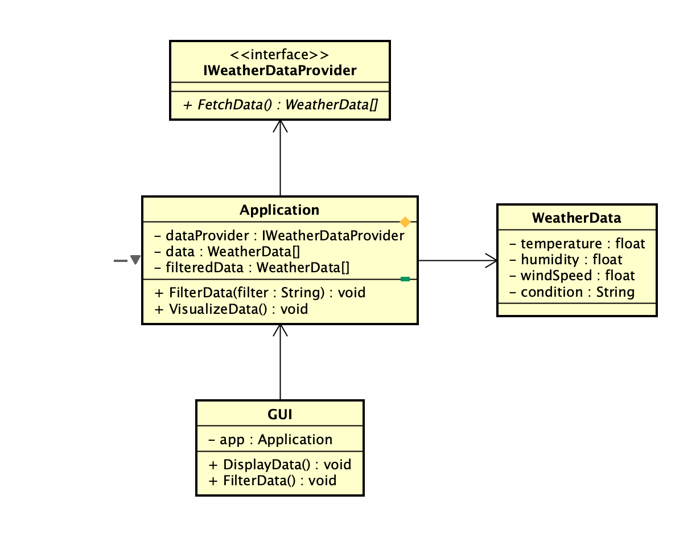

# **Weather Data Analysis Application**

## Introduction
This document serves as a start document and offers an overview for the practical assignment for the "Threading in C#" course. The purpose of this course is to teach students how to utilise different multi-threading techniques.

## Application description
The Weather Data Analysis application is going to fetch the data from a public API (such as IBM or WeatherAPI.com). The data set will contain at least 100.000 results. The processing of the data is going to be done using PLINQ and multi-threading. The results will be able to be seen in a graph. That means a GUI will be present. The user will be able to see on the graph (as data visualization) and filter certain weather conditions that he wants.

## Features
- Fetching data from an API
- Filtering said data
- A GUI to see filtered data
- Visualization of the data

## MoSCoW Analysis
| Priority      | Task		   |
| -----------   | ----------- |
| Must have     | API Fetching, Filtering of data, GUI, Multi-threading|     
| Should have   | Graph (visualization of data)        |
| Could have    | Exporting of data        |
| Won't have    | User registration, Multiple Language support        |

## Technology & Threading techniques used
As part of the course and in order to implement some of the features, the project will use a variety of threading techniques. These include the following:
- GitHub

- C# .NET Maui

- MVVM

## Multi-threading techniques used
- PLINQ is used for data processing and asynchronous programming (API fetching)
- Thread pool which is used for batch-processing tasks
- Lock, monitor, mutex, semaphore,etc. which it's going to be used that any shared data is thread safe

## Definition of done
The project is done, when the following requirements are met:
- The Start Document contains all the required features
- The application works as described
- All the must have functionalities have been implemented

## Class Diagram

## About the developers
| Name               | Student email                                                |
| ------------------ | ------------------------------------------------------------ |
| Nathan Mills      | [nathan.mills@student.nhlstenden.com](mailto:nathan.mills@student.nhlstenden.com) |
| Arian Atapour      | [arian.atapour@student.nhlstenden.com](mailto:arian.atapour@student.nhlstenden.com) |
| Evald Narkevicius | [evald.narkevicius@student.nhlstenden.com](mailto:evald.narkevicius@student.nhlstenden.com) |
| Jadyn Jacques | [jadyn.jacques@student.nhlstenden.com](mailto:jadyn.jacques@student.nhlstenden.com) |
