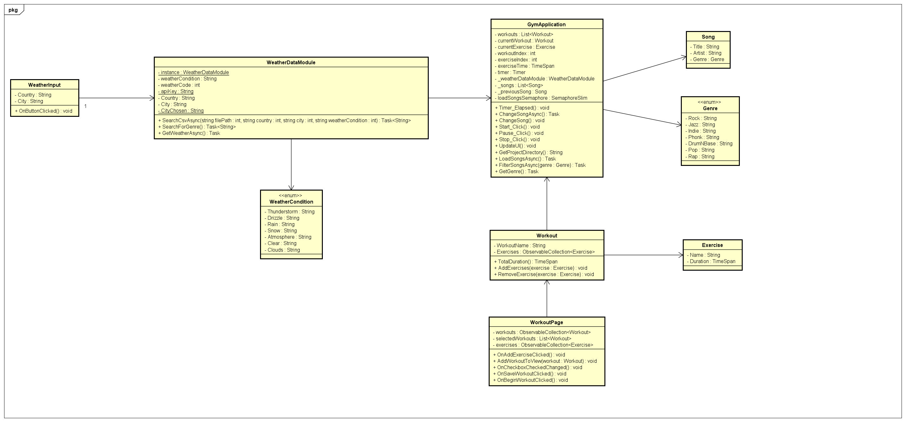

# **Gym Music Application**

## Introduction
This document serves as a start document and offers an overview for the practical assignment for the "Threading in C#" course. The purpose of this course is to teach students how to utilise different multi-threading techniques.

## Application description
The gym music application is going to be a desktop app running only on Windows machines which purpose is to play music based on the workout and weather outside. So, if you do pushups and it's raining for example, a certain song will be played. It will also display a timer and within that timer play the respective song. The weather it's going to be fetched from a weather API (at least 100.000 entries) and the workouts are going to be introduced by the user as well as their duration. The UI will have two parts. Once it's going to be the user input which it's gonna take the workout type and the time to do the workout. The second part of the UI is after data has been inserted, it's gonna show a screen with the workout and time. Once the user presses start, the workout begins. He can also press pause to pause the workout or stop to reset the workout from the beginning.
## Features
- User input
- Fetching data from a weather API
- Filtering of weather data wether it's raining, etc.
- A GUI to see workout and timer
- Pause and Stop of workout
- Songs played based on weather and type of workout 

## MoSCoW Analysis
| Priority      | Task		   |
| -----------   | ----------- |
| Must have     | API Fetching, Filtering of data, GUI, Multi-threading|     
| Should have   | Stop and Pause of workout       |
| Could have    | List of previous workouts       |
| Won't have    | User registration, Multiple Language support, Multiple OS support(it runs only on Windows)        |

## Technology
As part of the course and in order to implement some of the features, the project will use a variety of threading techniques. These include the following:
- GitHub

- C# .NET Maui

- MVVM

## Threading techniques used
- TPL (Task Parallel Library/Async & Await)
- Semaphore (SemaphoreSlim)
- PLINQ (Parallel LINQ)
- Asynchronous I/O

## Definition of done
The project is done, when the following requirements are met:
- The Start Document contains all the required features
- The application works as described
- All the must have functionalities have been implemented

## Class Diagram

## About the developers
| Name               | Student email                                                |
| ------------------ | ------------------------------------------------------------ |
| Nathan Mills      | [nathan.mills@student.nhlstenden.com](mailto:nathan.mills@student.nhlstenden.com) |
| Arian Atapour      | [arian.atapour@student.nhlstenden.com](mailto:arian.atapour@student.nhlstenden.com) |
| Evald Narkevicius | [evald.narkevicius@student.nhlstenden.com](mailto:evald.narkevicius@student.nhlstenden.com) |
| Jadyn Jacques | [jadyn.jacques@student.nhlstenden.com](mailto:jadyn.jacques@student.nhlstenden.com) |
